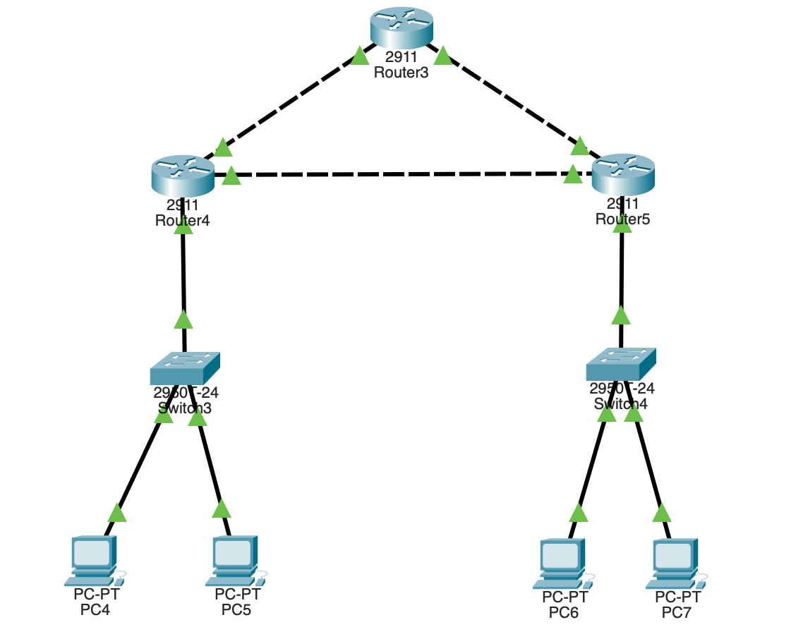

# RIP Protocol using packet tracer:

- 3 Router :[2911]
- 2 switch :[2950T-24]
- 4 PC’s    :PC-PT [PC0-PC3]

<aside>
👉🏻 Connetions :



**connecting PC 0 and PC1 with the Router 1 :**

| Devices | Interface | Ipv4 | Default Gateway |
| --- | --- | --- | --- |
| PC0 | FasteEthernet0 | 20.10.5.1 | 20.10.5.3 |
| PC1 | FasteEthernet0 | 20.10.5.2 | 20.10.5.3 |
| Router 1 | gig0/0 | 20.10.5.3 |  |

**connecting PC 2 and PC3 with the Router 2 :**

| Devices | Interface | Ipv4 | Default Gateway |
| --- | --- | --- | --- |
| PC2 | FasteEthernet0 | 30.10.5.1 | 30.10.5.3 |
| PC3 | FasteEthernet0 | 30.10.5.2 | 30.10.5.3 |
| Router 2 | gig0/0 | 30.10.5.3 |  |

---

**connecting Router 0 with Router 1 :**

| Device | Interface | ipv4 |
| --- | --- | --- |
| Router 0 | gig 0/0 | 40.10.5.1 |
| Router 1 | gig 0/1 | 40.10.5.2 |

**connecting Router 0 with Router 2 :**

| Device | Interface | ipv4 |
| --- | --- | --- |
| Router 0 | gig 0/1 | 50.10.5.1 |
| Router 2 | gig 0/2 | 50.10.5.2 |

**connecting Router 1 with Router 2 :**

| Device | Interface | ipv4 |
| --- | --- | --- |
| Router 1 | gig 0/2 | 60.10.5.1 |
| Router 2 | gig 0/1 | 60.10.5.2 |

---

## **RIP Configuration :**

Add the following Network Address in  :

- Router 0 → Config → RIP:
    
    ```
    40.0.0.0
    50.0.0.0
    ```
    
- Router 1 → Config → RIP:
    
    ```
    20.0.0.0
    40.0.0.0
    60.0.0.0
    ```
    
- Router 2 → Config → RIP:
    
    ```
    30.0.0.0
    50.0.0.0
    60.0.0.0
    ```
    
</aside>